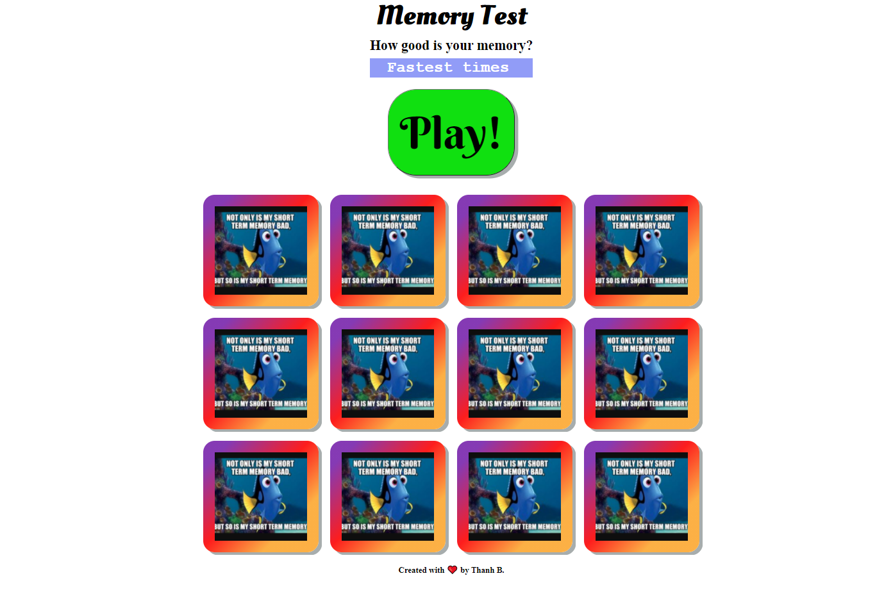

# Memory Test - How good is your memory?
Live version - https://thanh-barnes.github.io/memory-test/

This game was based on the Vanilla JS tutorial at:
https://medium.com/free-code-camp/vanilla-javascript-tutorial-build-a-memory-game-in-30-minutes-e542c4447eae

I have added my own flair to my version of the game. 

Some of the extra features include:
- play & start again button
- countdown timer for 60 seconds
- top 3 fastest times attempted displayed (using bubble sorting)

Other additonal features that are work in progress include:
- randomising images (so that it is not always the same 6)
- refactoring my wet code 

Please feel free to give me any feedback or suggestions as I am still learning and any advice would be good for me.

Thank you for visiting!

